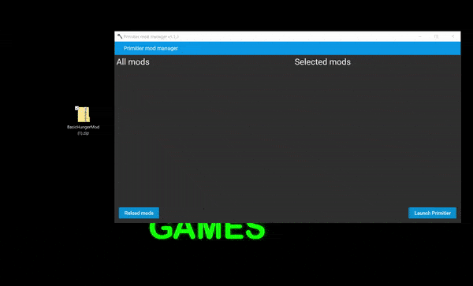
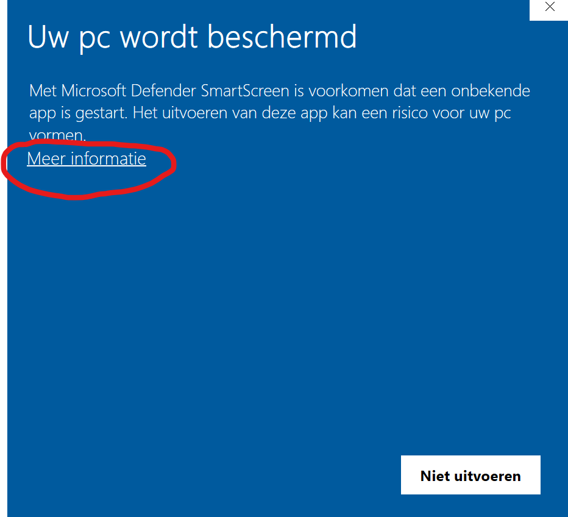
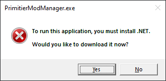

# Primitier mod manager
Primitier mod manager is a tool to easily install mods for Primitier.

## Downloading Mods.

## Step 1
Install the [latest release](https://github.com/Xgames123/PrimitierModManager/releases) (recommended) or you can go with a [manual install](./MANUAL_INSTALL_INSTRUCTIONS.md).

### Fixing error
If you get this click on More information. (This will go away if enough people download Primitier mod manager)

If you get this you have to install '.NET 5.0 desktop x64'

## Step 2
find a mod you want to download and drag it into Primitier mod manager
### some mods i have found
- [GracefulGal Primitive Engineering](https://cdn.discordapp.com/attachments/976952052477485166/1000870146543464458/Primitive_Engineering_v0.1.2.pmfm)
- [TotalJTM Creative mod](https://github.com/TotalJTM/PrimitierCreativeMode) (Currently broken but I have made a [fixed version](https://github.com/Xgames123/PrimitierCreativeMod))
- [Seva167 Thruster mod](https://github.com/Seva167/PrimitierMods/releases)
- [Seva167 Languages mod](https://github.com/Seva167/Primiter-LanguagesMod)
- [SomeRandomDude HungerMod](https://github.com/SomeRandomDude-git/PrimiterMods/tree/main/BasicHungerMod) (I don't know if this still works)

## Step 3
Click the arrow next to the mod to select it and
than click on the Launch Primitier button.

**Note: Sometimes the mod loader fixes itself after a couple of runs. So if you have errors try running again**
